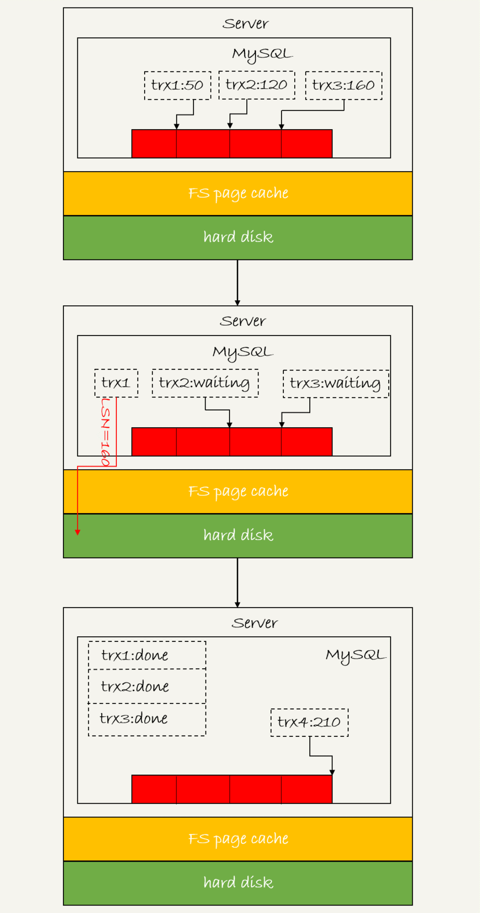
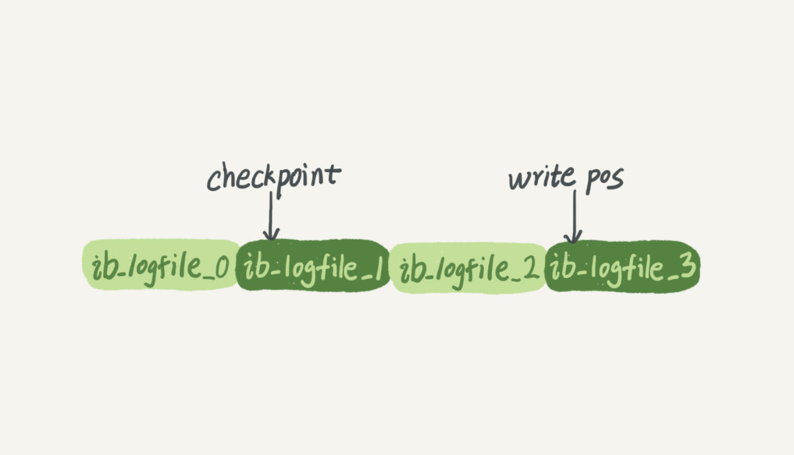

# mysql数据可靠性
#### binlog写入机制
* binlog cache 内存 --> write page cache --> fsync --> binlog 磁盘
* sync_binlog=0, 只write, 不fsync
* sync_binlog=1, 每次提交事务都会fsync
* sync_binlog 累积N个事务才fsync, 会丢失N个事务的binlog日志

#### redo log写入机制
* 三种状态
* redo log buffer 内存
* write-->page cache
* hard disk 持久化到磁盘
* innodb_flush_log_at_trx_commit 0 buffer 1 磁盘 2 page_cache

#### Mysql双一配置
*  sync_binlog 和 innodb_flush_log_at_trx_commit 都设置成 1。也就是说，一个事务完整提交前，需要等待两次刷盘，一次是 redo log（prepare 阶段），一次是 binlog。

#### 日志逻辑序列号
* LSN
* 多个事务刷盘采用组提交策略

#### binlog 组提交
* binlog_group_commit_sync_delay 参数，表示延迟多少微秒后才调用 fsync;
* binlog_group_commit_sync_no_delay_count 参数，表示累积多少次以后才调用 fsync。

#### WAL机制的优点
* redo log和 binlog都是顺序写
* 组提交机制

#### mysql出现IO性能瓶颈
* 设置 binlog_group_commit_sync_delay 和 binlog_group_commit_sync_no_delay_count 参数，减少 binlog 的写盘次数。这个方法是基于“额外的故意等待”来实现的，因此可能会增加语句的响应时间，但没有丢失数据的风险。
* 将 sync_binlog 设置为大于 1 的值（比较常见是 100~1000）。这样做的风险是，主机掉电时会丢 binlog 日志。
* 将 innodb_flush_log_at_trx_commit 设置为 2。这样做的风险是，主机掉电的时候会丢数据。 

#### 两阶段提交的本质
*  redo log 的写入拆成了两个步骤：prepare 和 commit，这就是"两阶段提交"。

#### Binlog两种模式
* statement 格式的话是记sql语句
* row格式会记录行的内容，记两条，更新前和更新后都有。

#### writepos和checkpoint
* “空着的部分”，就是write pos 到3号文件末尾，再加上0号文件开头到checkpoint 的部分。可以写入新的事物日志

#### 事务奔溃恢复原则
* 如果 redo log 里面的事务是完整的，也就是已经有了 commit 标识，则直接提交；
* 如果 redo log 里面的事务只有完整的 prepare，则判断对应的事务 binlog 是否存在并完整：
   a. 如果是，则提交事务；
   b. 否则，回滚事务。

#### sync_binlog
* sync_binlog->binlog_group_commit_sync_no_delay_count 

#### binlog cache 是每个线程自己维护的，而 redo log buffer 是全局共用的？
* MySQL 这么设计的主要原因是，binlog 是不能“被打断的”。一个事务的 binlog 必须连续写，因此要整个事务完成后，再一起写到文件里。
* 而 redo log 并没有这个要求，中间有生成的日志可以写到 redo log buffer 中。redo log buffer 中的内容还能“搭便车”，其他事务提交的时候可以被一起写到磁盘中。
