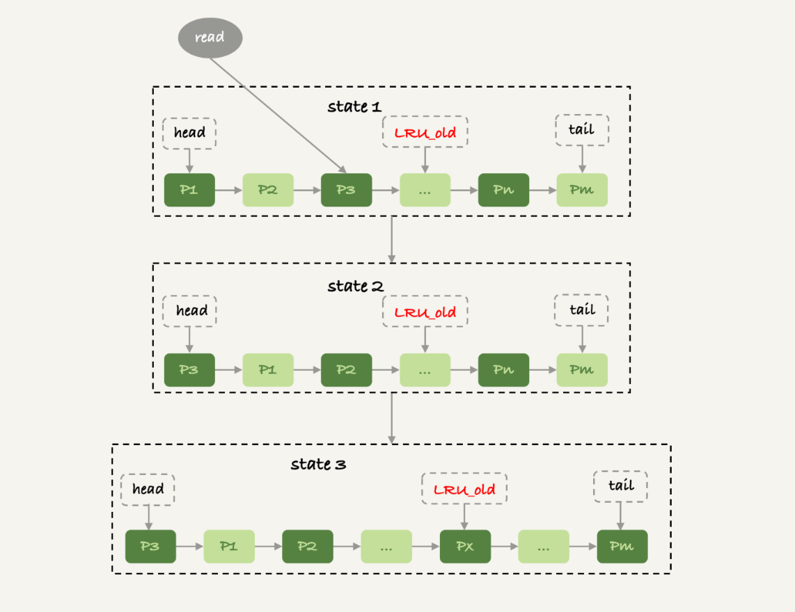

# 查询和内存
#### 取发数据流程
* 获取一行，写到 net_buffer 中。这块内存的大小是由参数 net_buffer_length 定义的，默认是 16k。
* 重复获取行，直到 net_buffer 写满，调用网络接口发出去。
* 如果发送成功，就清空 net_buffer，然后继续取下一行，并写入 net_buffer。
* 如果发送函数返回 EAGAIN 或 WSAEWOULDBLOCK，就表示本地网络栈（socket send buffer）写满了，进入等待。直到网络栈重新可写，再继续发送。
 

#### Buffer Pool的内存改进版LRU算法
* 

#### 查询区别
*  mysql_use_result 方法。这个方法是读一行处理一行
*  mysql_store_result 这个接口，直接把查询结果保存到本地内存

#### 查询语句的状态变化
* MySQL 查询语句进入执行阶段后，首先把状态设置成“Sending data”；
* 发送执行结果的列相关的信息（meta data) 给客户端；
* 再继续执行语句的流程；
* 执行完成后，把状态设置成空字符串