# Redis集群深入

#### 伸缩原理
* 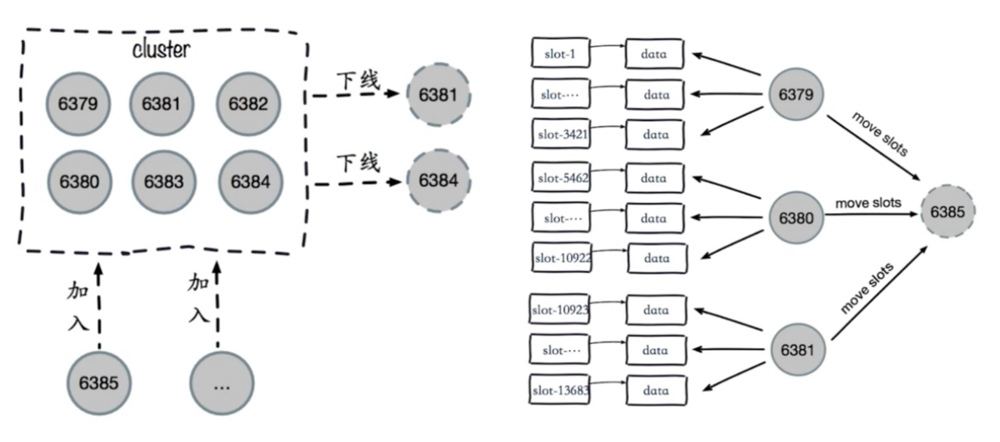
* 槽和数据在节点之间移动

#### 集群扩容
* 准备新节点
* 加入集群
* 迁移槽和数据

#### 加入集群
* 为它迁移槽和数据实现扩容
* 作为从节点负责故障转移

#### 迁移槽数据
* 槽迁移计算
* 迁移数据
* 添加从节点
* 

#### 数据迁移
* 对目标节点发送：cluster setslot{ slot) importing{ source Nodeld}命令，让目标节点准备导入槽的数据。
* 对源节点发送：cluster setslot{slot} migrating{ target Nodelc아命令，让源节点准备迁出槽的数据。
* 源节点循环执行 cluster getkeysinslot{slot{ count}命令，每次获取 count 个属于槽的健
* 在源节点上执行 migrate  (ftargetlp)  (targetport) key0{ timeout 命令把指定 key 迁移重复执行步骤 3~4 直到槽下所有的键数据迁移到目标节点。
* 向集群内所有主节点发送 cluster setslot{ slot) node ftargetnodeld}命令，通知槽分配给目标节点。
* 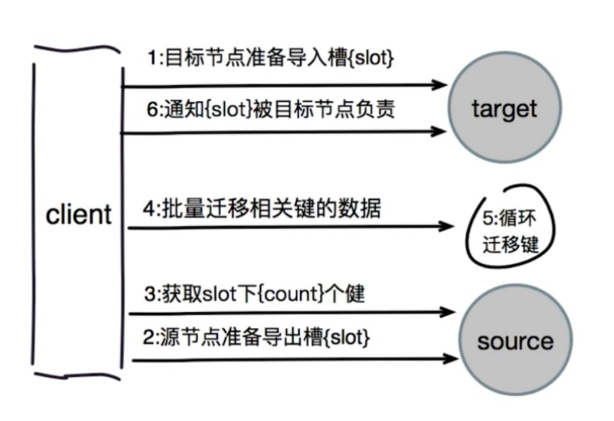
* pipeline migrate
* 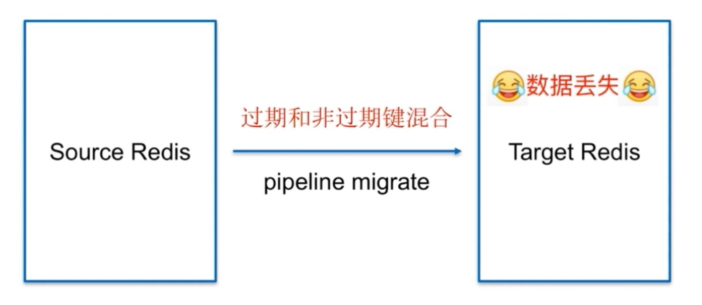

#### 集群收缩
* 
* cluster forget
* redis-trib reshard --from nodeid --to nodeid --slots nums ip port
* redis-trib del-node ip:port nodeid
* 先主后从

#### 客户端
* 

#### 重定向
* move重定向
* 
* ask重定向
* 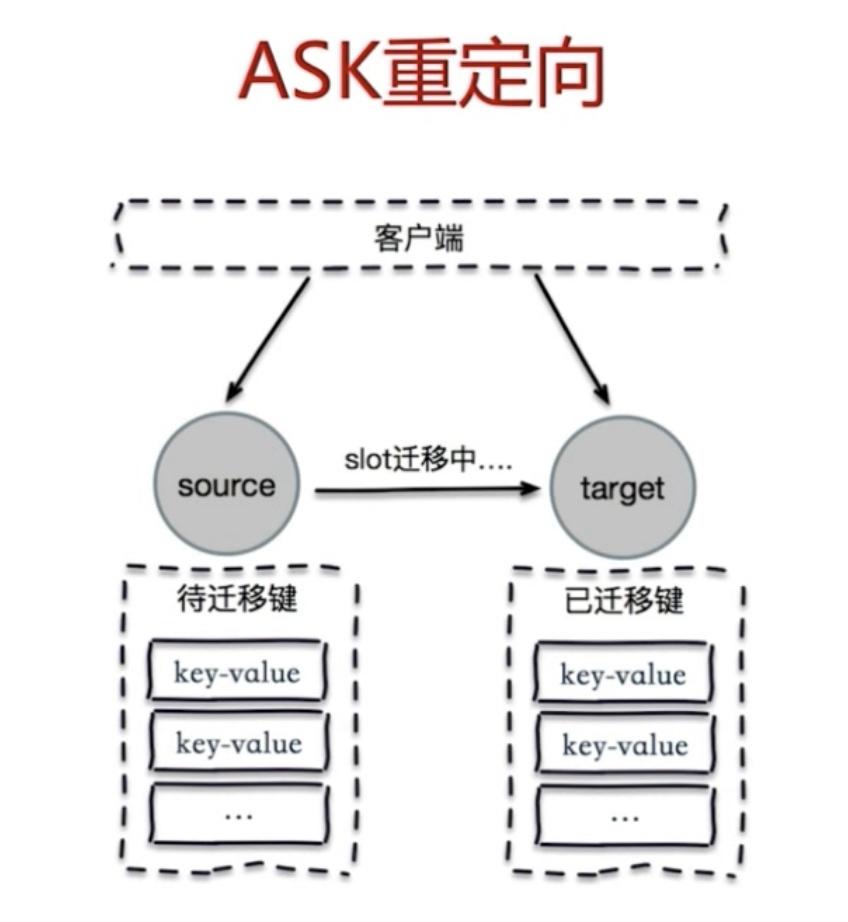
* 
* 对比
* 
* 随机访问和性能

#### smart客户端
* 
* 

#### 批量操作
* mget mset必须在同一个槽
* 串行mget
* 串行IO
* 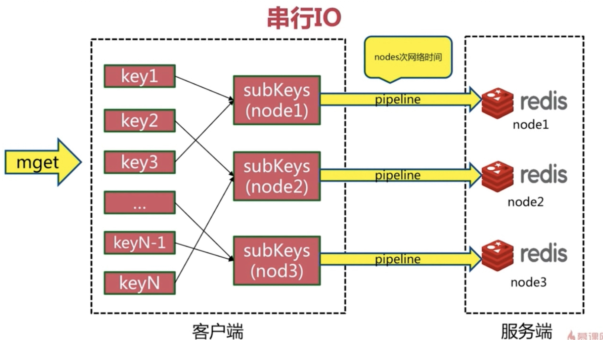
* 并行IO
* 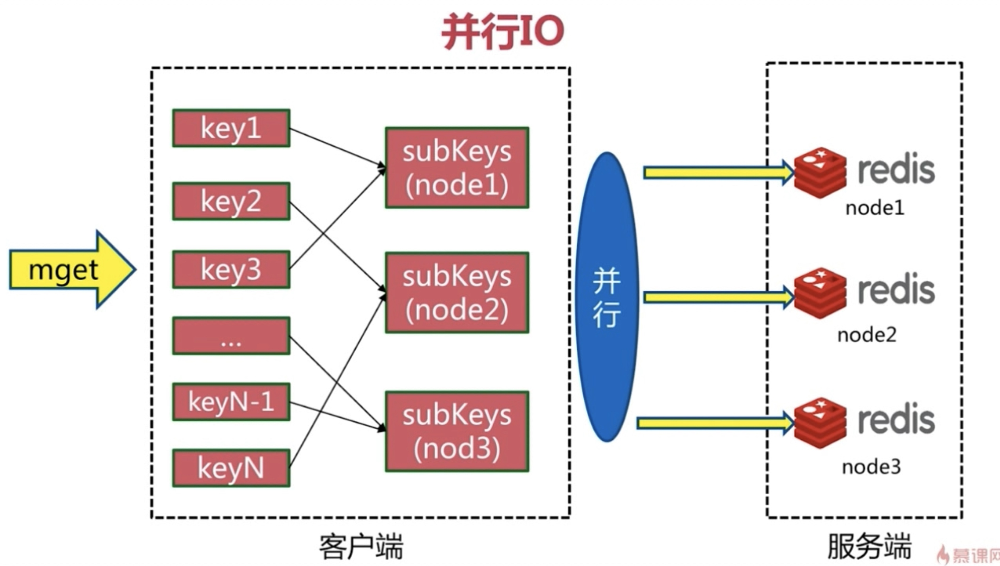
* hash_tag
* 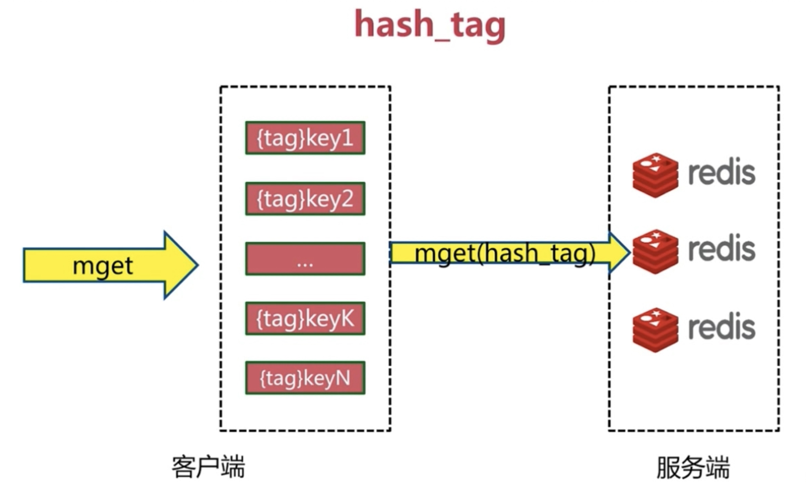
* 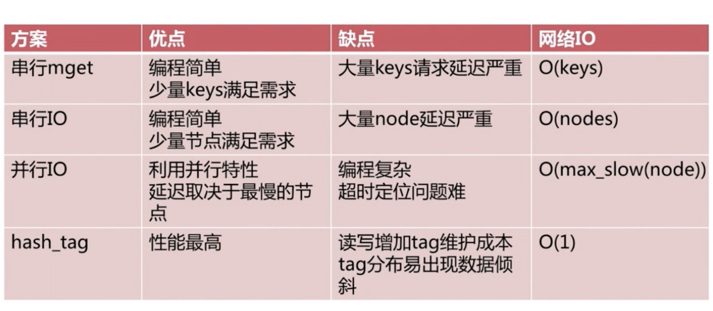
* hash_tag Redis中引入了HashTag的概念，可以让算法只对key的某一部分进行计算，让key落到相同数据分片。

#### 故障转移
* 故障发现
* ping/pong消息实现故障发现
* 主观下线
* 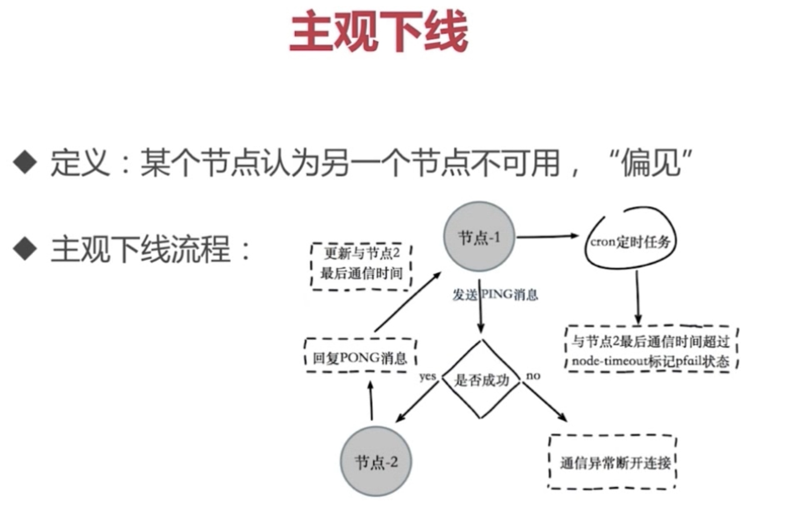
* 客观下线
* 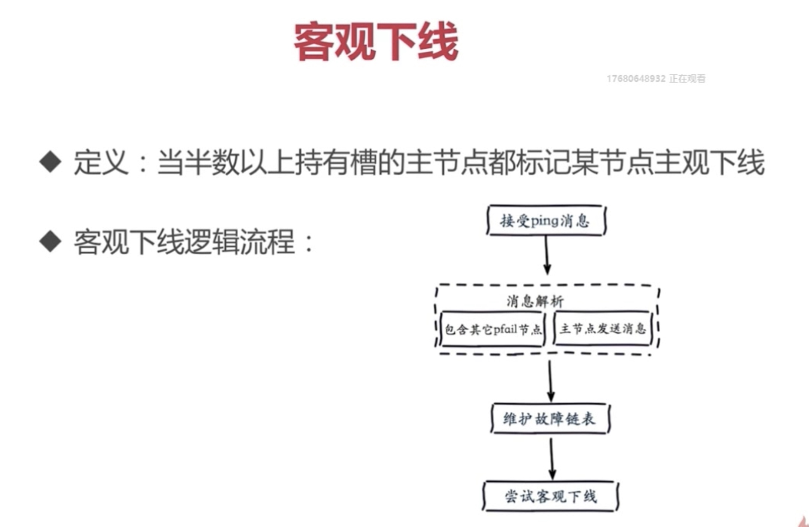
* 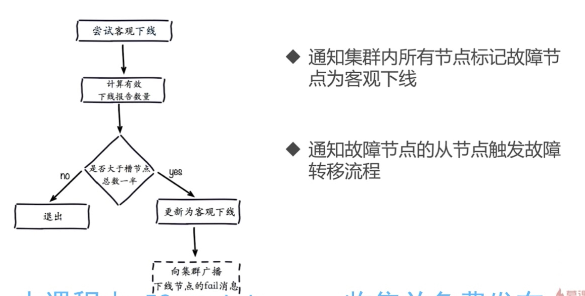

#### 故障恢复
* 资格检查
* 
* 准备选举时间
* 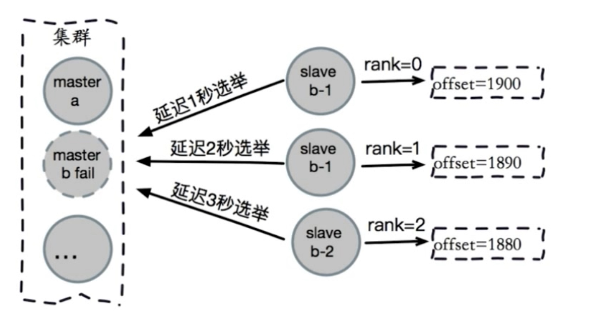
* 选举投票
* 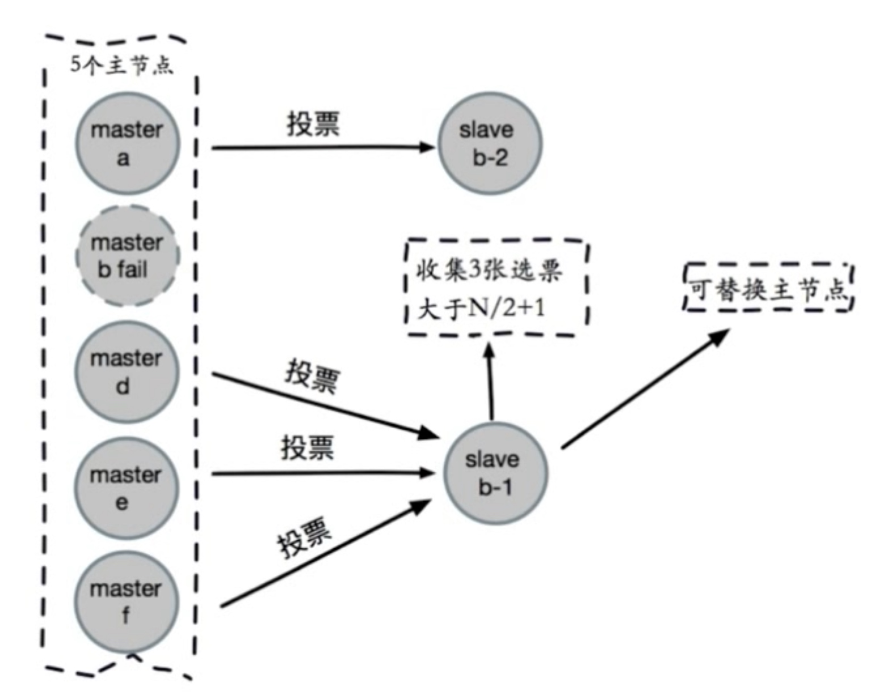
* 替换主节点
* 

#### 集群完整性
* Cluster-require- full-coverages 默认为 yes
* 集群中 16384 个槽全部可用：保证集群完整性 17680648932 正在看
* 节点故障或者正在故障转移 (error) CLUSTERDOWN The cluster is down
* 大多数业务无法容忍，cluster-require- full-coverages 建议设置为 no

#### 带宽消耗
* 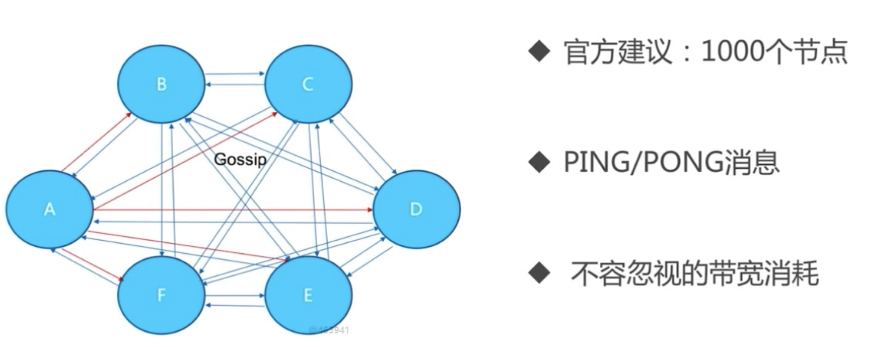
* 消息发送频率：节点发现与其它节点最后通信时间超过 cluster node- timeout,/2时会直接发送ping消息 0463941
* 消息数据量：slots槽数组(2KB空间)和整个集群1/10的状态数据（10 个节点状态数据约 1 KB)
* 节点部署的机器规模：集群分布的机器越多且每台机器划分的节点数越均匀，则集群内整体的可用带宽越高。

##### 优化
* 避免多业务使用一个集群，大业务可以多集群
* cluster-node-timeout 带宽和故障转移速度的均衡。尽量均匀分配到多机器上
* 保证高可用和带宽

#### Pub/Sub 广播
* 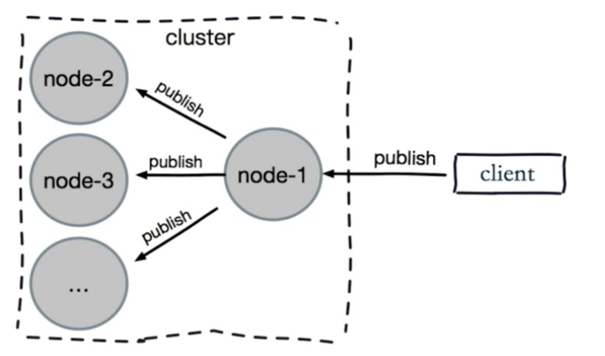
* 问题：publish 在集群每个节点广播：加重带宽
* 解决：单独“走”一套 Redis Sentinel

####  数据倾斜 

##### 内存不均
* 节点和槽分配不均
* redis-cli info ip:port
* redis-cli reshard ip:port

##### 不同槽对应键值数量差异较大
* CRC16 正常情况下比较均匀
* 可能存在 hash_tag
* cluster countkeysinslot{slt}获取槽对应键值个数

##### 包含bigkey
* Bigley：例如大字符串、几百万的元素的 hash、set 等从节点：
* redis-cli- bigkeys
* 优化：优化数据结构。

##### 内存相关配置不一致
* Hash-max-ziplist-value, set-max-intset-entriess 
* 优化：定期“检查”配置一致性

##### 请求倾斜
* 热点 key：重要的 key 或者 bigley 
* 优化避免 bigley 热键
* 不要用 hash_tag
* 当一致性不高时，可以用本地缓存+MQ

#### 集群读写分离

##### 只读连接：集群模式的从节点不接受任何读写请求
* 重定向到负责槽的主节点
* readonly 命令可以读：连接级别命令

##### 读写分离：更加复杂
* 同样的问题：复制延退、读取过期数据、从节点故障
* 修改客户端：cluster slaves{ nodeld}

#### 数据迁移

##### redis-trib.rb import 
* 只能从单机迁移到集群不支持在线迁移：
* source 需要停写
* 不支持断点续传
* 单线程迁移：影响速度

##### 在线迁移
* 唯品会 redis- migrate-tool 
* 豌豆英：redis-port

#### 集群限制
* Key 批量操作支持有限：例如 mget、mset 必须在一个 slot 
* Key 事务和 Lua 支持有限：操作的 key 必须在一个节点 
* Key 是数据分区的最小粒度：不支持 bigkey 分区
* 不支持多个数据库：集群模式下只有一个 db0
* 复制只支持一层。不支持树形复制

#### 分布式Redis
* Redis Cluster：满足容量和性能的扩展性，很多业务”不需要”
* 大多数时客户端性能会”降低”。
* 命令无法跨节点使用：mget、keys、scan、flush、sintera 等。Lua 和事务无法跨节点使用。
* 客户端维护更复杂：SDK 和应用本身消耗（例如更多的连接池）。
* 很多场景 Redis Sentinel 已经足够好。

#### 集群总结
* 使用 smart 客户端操作集群达到通信效率最大化，客户端内部负责计算维护键-》槽-》节点的映射，用于快速定位到目标节点。
* 集群自动故障转移过程分为故障发现和节点恢复。节点下线分为主观下线和客观下线，当超过半数主节点认为故障节点为主观下线时标记它为客观下线状态。从节点负责对客观下线的主节点触发故障恢复流程，保证集群的可用性。
* 开发运维常见问题包括: 超大规模集群带宽消耗,pub/sub 广播问题，集
* 群倾斜问题，单机和集群对比等