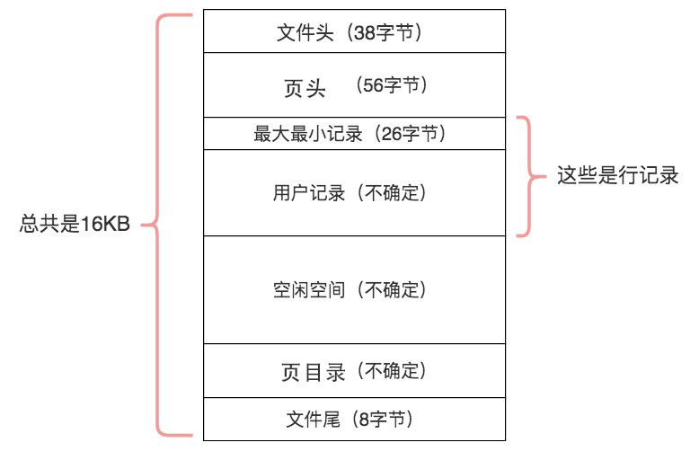

# 数据页的角度理解B+树

#### 存储结构
* 
* 一个表空间包括了一个或多个段，一个段包括了一个或多个区，一个区包括了多个页，而一个页中可以有多行记录
* 区大小是64*16KB
* 创建一张表时会创建一个表段，创建一个索引时会创建一个索引段
* 表空间从管理上可以划分为系统表空间、用户表空间、撤销表空间、临时表空间等

#### 数据页结构

* 文件头中有两个字段，分别是 FIL_PAGE_PREV 和 FIL_PAGE_NEXT，它们的作用相当于指针，分别指向上一个数据页和下一个数据页。连接起来的页相当于一个双向的链表
* 数据页之间不需要是物理上的连续，而是逻辑上的连续
* 数据页内数据的物理存放顺序与索引顺序是一致的

#### 数据页检索

* 页目录，它起到了记录的索引作用，因为在页中，记录是以单向链表的形式进行存储的。单向链表的特点就是插入、删除非常方便，但是检索效率不高，最差的情况下需要遍历链表上的所有节点才能完成检索，因此在页目录中提供了二分查找的方式，用来提高记录的检索效率

#### 查询成本
* last_query_cost 需要的数据页面
* 