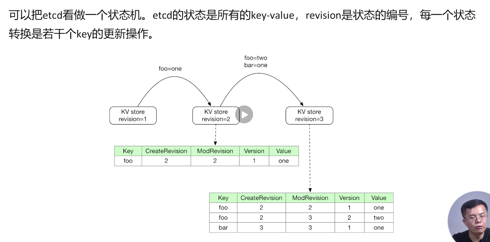
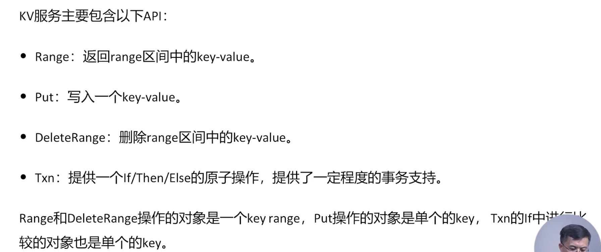
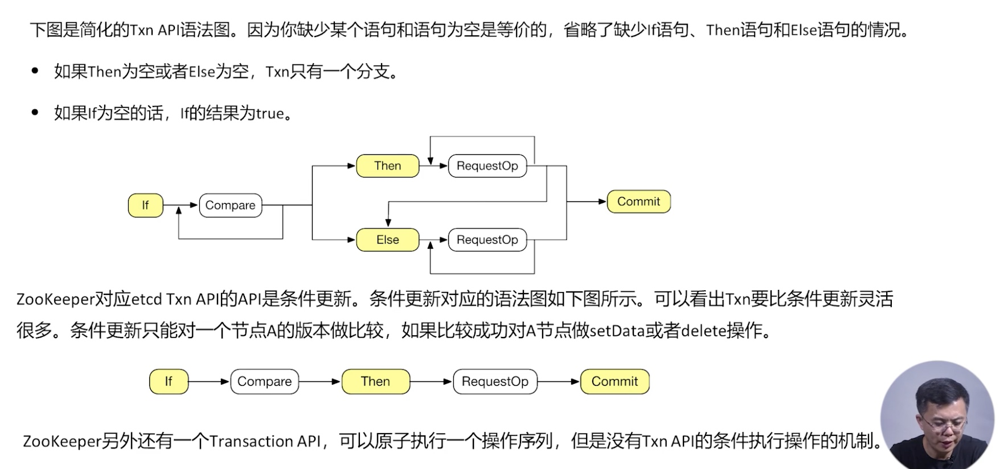
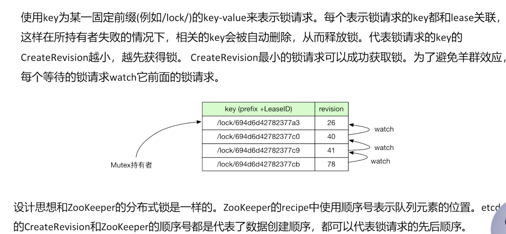

# Etcd

#### 对比

* 

#### MVCC
* 

#### 数据存储


#### 命令行
* etcdctl get "" --prefix=true
* etcdctl del "" --prefix=true

#### etcdAPI

* header

* keyvalue

* keyrange

* kv

* TXn API


* Watch API

* Lease API


```go
package etcd_code

import (
	"context"
	"fmt"
	v3 "go.etcd.io/etcd/clientv3"
	"testing"
)

func printGetResponse(r *v3.GetResponse) {
	fmt.Printf("response header: %q\n", r.Header)
	fmt.Printf("kvs: %v\n", r.Kvs)
	fmt.Printf("more: %t\n", r.More)
	fmt.Printf("count: %d\n", r.Count)
}

// Run beforehand:
// 	etcdctl put TestGet 1
func TestGet(t *testing.T) {
	cli := newClient(t)
	defer cli.Close()

	key := "TestGet"

	response, err := cli.Get(context.Background(), key)
	if err != nil {
		t.Fatal(err)
	}
	printGetResponse(response)
}

// Run beforehand:
// 	etcdctl put TestGetWithPrefix 1
// 	etcdctl put TestGetWithPrefix2 2
func TestGetWithPrefix(t *testing.T) {
	cli := newClient(t)
	defer cli.Close()

	keyPrefix := "TestGetWithPrefix"
	response, err := cli.Get(context.Background(), keyPrefix, v3.WithPrefix())
	if err != nil {
		t.Fatal(err)
	}
	printGetResponse(response)
}

// Run beforehand:
// 	etcdctl put TestGetWithRange 1
// 	etcdctl put TestGetWithRange2 2
func TestGetWithRange(t *testing.T) {
	cli := newClient(t)
	defer cli.Close()

	response, err := cli.Get(context.Background(), "TestGetWithRange", v3.WithRange("TestGetWithRange2\x00"))
	if err != nil {
		t.Fatal(err)
	}
	printGetResponse(response)
}

// Run beforehand:
// 	etcdctl put TestGetWithSerializable 1
func TestGetWithSerializable(t *testing.T) {
	cli := newClient(t)
	defer cli.Close()

	key := "TestGetWithSerializable"
	response, err := cli.Get(context.Background(), key, v3.WithSerializable())
	if err != nil {
		t.Fatal(err)
	}
	printGetResponse(response)
}

func TestPut(t *testing.T) {
	cli := newClient(t)
	defer cli.Close()

	key := "TestPut"
	response, err := cli.Put(context.Background(), key, "1", v3.WithPrevKV())
	if err != nil {
		t.Fatal(err)
	}
	fmt.Printf("header: %q\n", response.Header)
	fmt.Printf("prev_kv: %q\n", response.PrevKv)
}

// Run beforehand:
// 	etcdctl put TestDelete 1
func TestDelete(t *testing.T) {
	cli := newClient(t)
	defer cli.Close()

	key := "TestDelete"
	response, err := cli.Delete(context.Background(), key)
	if err != nil {
		t.Fatal(err)
	}
	fmt.Printf("header: %v\n", response.Header)
	fmt.Printf("deleted: %d\n", response.Deleted)
	fmt.Printf("pre_kvs: %v\n", response.PrevKvs)
}

// Run beforehand:
//	etcdctl put TestTxn 1
func TestTxn(t *testing.T) {
	cli := newClient(t)
	defer cli.Close()

	key := "TestTxn"
	thenValue := "then"

	ctx := context.Background()
	_, err := cli.Txn(ctx).
		If(v3.Compare(v3.Value(key), "<", "2")).
		Then(v3.OpPut(key, thenValue)).
		Else(v3.OpPut(key, "else")).
		Commit()
	if err != nil {
		t.Fatal(err)
	}

	// Return "then"
	gresp, err := cli.Get(ctx, key)
	if err != nil {
		t.Fatal(err)
	}

	if l := len(gresp.Kvs); l != 1 {
		t.Errorf("expeected 1 key-value, but got %d key-values\n", l)
	}

	if value := string(gresp.Kvs[0].Value); value != "then" {
		t.Errorf("expected value %s, but got %s\n", thenValue, value)
	}

	for _, ev := range gresp.Kvs {
		fmt.Printf("%s: %s\n", ev.Key, ev.Value)
	}
	//delete(cli, key, t)
}

func TestTxnOpOrder(t *testing.T) {
	cli := newClient(t)
	defer cli.Close()
	key := "TestTxnOpOrder"

	ctx := context.Background()
	// If CreateRevision is 0, it means that the key does not exist.
	cmp := v3.Compare(v3.CreateRevision(key), "=", 0)
	put := v3.OpPut(key, "1")
	get := v3.OpGet(key)

	// Get Put
	resp, err := cli.Txn(ctx).If(cmp).Then(get, put).Commit()
	if err != nil {
		t.Fatal(err)
	}
	printTxnResponse(resp)
	if l := len(resp.Responses[0].GetResponseRange().Kvs); l != 0 {
		t.Errorf("expeected 0 key-value, but got %d key-values\n", l)
	}
	delete(ctx, cli, key, t)

	// Put Get
	resp, err = cli.Txn(ctx).If(cmp).Then(put, get).Commit()
	if err != nil {
		t.Fatal(err)
	}
	printTxnResponse(resp)
	if l := len(resp.Responses[1].GetResponseRange().Kvs); l != 1 {
		t.Errorf("expeected 1 key-value, but got %d key-values\n", l)
	}
	delete(ctx, cli, key, t)
}

func TestTxnMultis(t *testing.T) {
	cli := newClient(t)
	defer cli.Close()
	ctx := context.Background()

	keyPrefix := "TestTxnMultis"
	keys := []string{keyPrefix + "1", keyPrefix + "2"}
	var cmps [2]v3.Cmp
	var puts [2]v3.Op
	var gets [2]v3.Op
	for i := 0; i < 2; i++ {
		val := string(i + 1)
		cmps[i] = v3.Compare(v3.CreateRevision(keys[i]), "=", 0)
		puts[i] = v3.OpPut(keys[i], val)
		gets[i] = v3.OpGet(keys[i])
	}

	// Executes two Puts
	tresp, err := cli.Txn(ctx).If(cmps[:]...).Then(puts[:]...).Else(gets[:]...).Commit()
	if err != nil {
		t.Fatal(t)
	}
	if !tresp.Succeeded {
		t.Fatal("Txn should succeed, but failed")
	}

	// Executes two Gets
	tresp, err = cli.Txn(ctx).If(cmps[:]...).Then(puts[:]...).Else(gets[:]...).Commit()
	if err != nil {
		t.Fatal(t)
	}
	if tresp.Succeeded {
		t.Fatal("Txn should fail, but succeeded")
	}
	for i := 0; i < 2; i++ {
		if count := tresp.Responses[i].GetResponseRange().Count; count != 1 {
			t.Errorf("expected 1 value for key %s, but got %d value", keys[0], count)
		}
	}

	// Execute two Deletes
	tresp, err = cli.Txn(ctx).Then(v3.OpDelete(keys[0]), v3.OpDelete(keys[1])).Commit();
	if err != nil {
		t.Fatal(err)
	}
	for _, r := range tresp.Responses {
		if deleted := r.GetResponseDeleteRange().Deleted; deleted != 1 {
			t.Fatalf("expected to delete 1 key-value, but deleted %d key-value", deleted)
		}
	}
	gresp, err := cli.Get(ctx, keyPrefix, v3.WithPrefix())
	if gresp.Count != 0 {
		t.Errorf("expected 0 key-values, bot got %d", gresp.Count)
	}
}

func printTxnResponse(resp *v3.TxnResponse) {
	fmt.Printf("response header: %q\n", resp.Header)
	fmt.Printf("succeeded: %t\n", resp.Succeeded)
}

// version revision test
func TestVersionAndRevision(t *testing.T) {
	cli := newClient(t)
	defer cli.Close()
	key := "TestVersionAndRevision"
	ctx := context.Background()

	put(ctx, cli, key, t)
	get(ctx, cli, key, t)
	put(ctx, cli, key, t)
	get(ctx, cli, key, t)
	delete(ctx, cli, key, t)

	put(ctx, cli, key, t)
	get(ctx, cli, key, t)
	put(ctx, cli, key, t)
	get(ctx, cli, key, t)
}

func put(ctx context.Context, cli *v3.Client, key string, t *testing.T) {
	fmt.Println("Put")
	response, err := cli.Put(ctx, key, "one", v3.WithPrevKV())
	if err != nil {
		t.Fatal(err)
	}
	fmt.Printf("put revision: %d\n", response.Header.Revision)
	fmt.Printf("prev_kv: %v\n\n", response.PrevKv)
}

func get(ctx context.Context, cli *v3.Client, key string, t *testing.T) {
	fmt.Println("Get")
	response, err := cli.Get(ctx, key, v3.WithPrevKV())
	if err != nil {
		t.Fatal(err)
	}
	fmt.Printf("get revision: %d\n", response.Header.Revision)
	fmt.Printf("kvs: %v\n\n", response.Kvs)
}

func delete(ctx context.Context, cli *v3.Client, key string, t *testing.T) {
	fmt.Println("Delete")
	response, err := cli.Delete(ctx, key, v3.WithPrevKV())
	if err != nil {
		t.Fatal(err)
	}
	fmt.Printf("delete revision: %d\n", response.Header.Revision)
	fmt.Printf("deleted: %d\n", response.Deleted)
	fmt.Printf("prev_kvs: %v\n\n", response.PrevKvs)
}
```

#### 分布式队列
* 

#### 分布式锁
* 
* 
* 