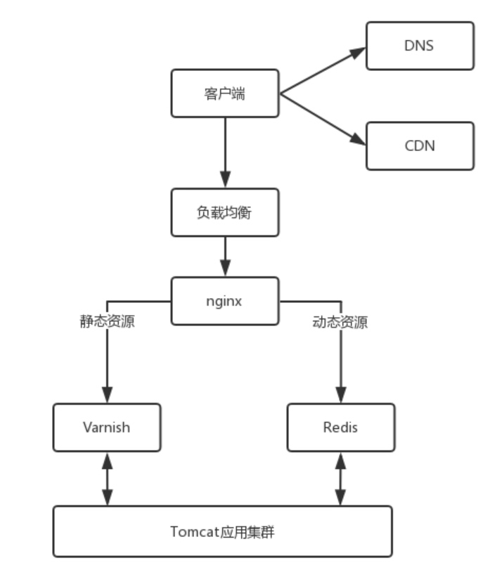

# CDN
#### CDN分发系统的架构
 

#### 客户端如何找到相应的边缘节点进行访问呢？
* CDN权威DNS服务器
* CDN全局负载均衡
* 根据用户 IP 地址，判断哪一台服务器距用户最近；
* 用户所处的运营商；
* 根据用户所请求的 URL 中携带的内容名称，判断哪一台服务器上有用户所需的内容；
* 查询各个服务器当前的负载情况，判断哪一台服务器尚有服务能力。
* 返回所需的边缘节点IP，如果没有这台服务器就要向它的上一级缓存服务器请求内容，直至追溯到网站的源服务器将内容拉到本地。

#### 缓存

#### 动态CDN
* 一种为生鲜超市模式，也即边缘计算的模式。数据的逻辑计算和存储，也相应的放在边缘的节点。其中定时从源数据那里同步存储的数据，然后在边缘进行计算得到结果。
* 另一种是冷链运输模式，也即路径优化的模式。数据不是在边缘计算生成的，而是在源站生成的，但是数据的下发则可以通过 CDN 的网络，对路径进行优化。

#### 思考题
* CDN 使用 DNS 进行全局负载均衡的例子，CDN 如何使用 HTTPDNS 呢？
* 客户端请求服务URL:umc.danuoyi.alicdn.com xxx，参数是客户端ip地址和待解析的域名；然后返回多个ip地址，客户端轮训这些ip地址。
* 
