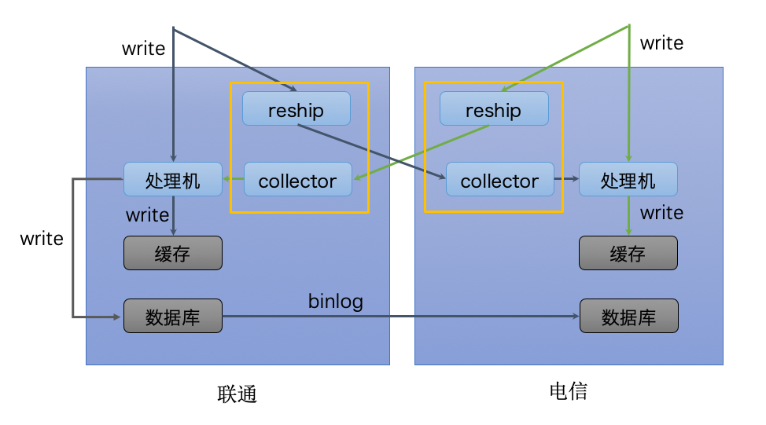

# 微服务多机房部署
#### 多机房负载均衡

#### 多机房数据同步

##### 主从机房架构

##### 独立机房架构
* 通过一个叫 WMB 的消息同步组件把各自机房的写请求同步一份给对方机房，每个机房的处理机接收到写请求后更新各自机房的缓存，只有一个机房会更新数据库，其他机房的数据库通过 MySQL 的 binlog 同步机制实现数据同步

#### WMB消息同步组件
* reship，负责把本机房的写请求分发一份给别的机房。
* collector，负责从别的机房读取写请求，然后再把请求转发给本机房的处理机。
* MCQ消息队列
* RPC调用

#### 多机房数据的一致性
* 系统会给每一次写请求生成一个全局唯一的 requestId
* 是处理成功或者失败都记录一条包含 requestId 和机房标记的处理日志，并写到 Elasticsearch 集群上去
* 通过一个定时线程，每隔 1 分钟去扫描 Elasticsearch 集群上的日志，找出包含同一个 requestId 的不同机房的处理日志
* 如果有的机房某一阶段处理失败，则可以根据日志信息重试该阶段直到成功，从而保证数据的最终一致性
* 