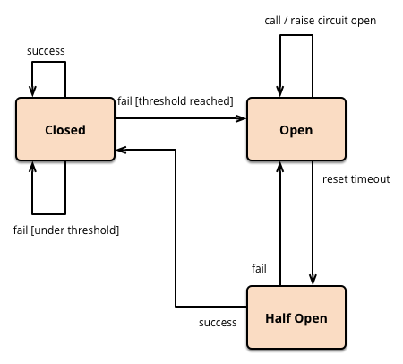

# 微服务调用失败的处理手段
#### 超时
* 参照服务提供者线上真实的服务水平，取 P999 或者 P9999 的值，也就是以 99.9% 或者 99.99% 的调用都在多少毫秒内返回为准。

#### 重试

#### 双发
* 一个简单的提高服务调用成功率的办法就是每次服务消费者要发起服务调用的时候，都同时发起两次服务调用，一方面可以提高调用的成功率，另一方面两次服务调用哪个先返回就采用哪次的返回结果
* 备份请求”（Backup Requests），它的大致思想是服务消费者发起一次服务调用后，在给定的时间内如果没有返回请求结果，那么服务消费者就立刻发起另一次服务调用
* 最大重试比例可以设置成 15%

#### 熔断
* 熔断就是把客户端的每一次服务调用用断路器封装起来，通过断路器来监控每一次服务调用。如果某一段时间内，服务调用失败的次数达到一定阈值，那么断路器就会被触发，后续的服务调用就直接返回，也就不会再向服务提供者发起请求了。
* 熔断中断路器
* Closed状态
* Open状态: 当服务调用失败次数达到一定阈值时，断路器就会处于开启状态，后续的服务调用就直接返回，不会向服务提供者发起请求
* Half Open 状态：当断路器开启后，每隔一段时间，会进入半打开状态，这时候会向服务提供者发起探测调用，以确定服务提供者是否恢复正常。如果调用成功了，断路器就关闭；如果没有成功，断路器就继续保持开启状态，并等待下一个周期重新进入半打开状态。
* 

#### Hystrix
* 滑动窗口包含 10 个桶，每个桶时间宽度为 1 秒，每个桶内记录了这 1 秒内所有服务调用中成功的、失败的、超时的以及被线程拒绝的次数。当新的 1 秒到来时，滑动窗口就会往前滑动，丢弃掉最旧的 1 个桶，把最新 1 个桶包含进来。
* 0 个桶内记录的所有失败的、超时的、被线程拒绝的调用次数之和除以总的调用次数就是滑动窗口内所有服务的调用的失败率

#### 总结
* 采用双发对长尾请求的场景十分有效

#### 思考题
* Hystrix 采用了线程池隔离的方式来实现不同的服务调用相互之间不影响，你认为这种方式的优缺点有哪些？
* （1）线程池隔离模式：使用一个线程池来存储当前的请求，线程池对请求作处理，设置任务返回处理超时时间，堆积的请求堆积入线程池队列。这种方式需要为每个依赖的服务申请线程池，有一定的资源消耗，好处是可以应对突发流量（流量洪峰来临时，处理不完可将数据存储到线程池队里慢慢处理）
* （2）信号量隔离模式：使用一个原子计数器（或信号量）来记录当前有多少个线程在运行，请求来先判断计数器的数值，若超过设置的最大线程个数则丢弃改类型的新请求，若不超过则执行计数操作请求来计数器+1，请求返回计数器-1。这种方式是严格的控制线程且立即返回模式，无法应对突发流量（流量洪峰来临时，处理的线程超过数量，其他的请求会直接返回，不继续去请求依赖的服务）
* 优点：可以防止某个服务占满可以使用的线程，影响其他服务
* 缺点：如果运行线程特别多，线程上下文切换成本较高。

#### 幂等性
* 对同一个系统，使用同样的条件，一次请求和重复的多次请求对系统资源的影响是一致的
* MVCC
* 去重表
* Token机制