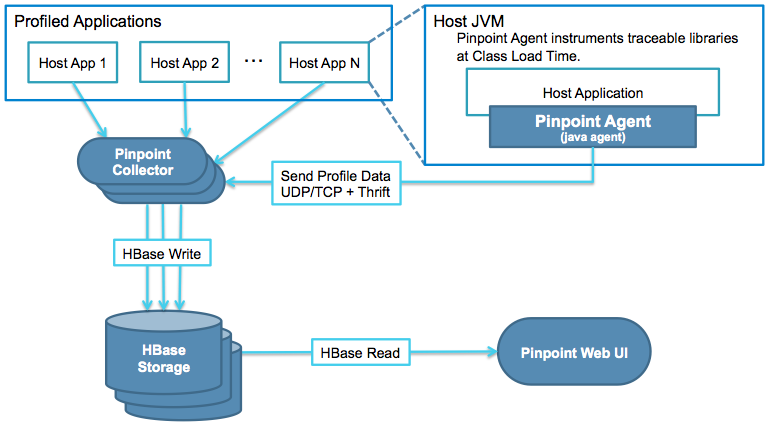

# 服务追踪系统
#### 构成
* 埋点数据收集，负责在服务端进行埋点，来收集服务调用的上下文数据。
* 实时数据处理，负责对收集到的链路信息，按照 traceId 和 spanId 进行串联和存储。
* 数据链路展示，把处理后的服务调用数据，按照调用链的形式展示出来。

#### 开源实现
* 阿里的鹰眼、Twitter 开源的 OpenZipkin，还有 Naver 开源的 Pinpoint

#### OpenZipkin
* 
* Collector：负责收集探针 Reporter 埋点采集的数据，经过验证处理并建立索引。
* Storage：存储服务调用的链路数据，默认使用的是 Cassandra，是因为 Twitter 内部大量使用了 Cassandra，你也可以替换成 Elasticsearch 或者 MySQL。
* API：将格式化和建立索引的链路数据以 API 的方式对外提供服务，比如被 UI 调用。
* UI：以图形化的方式展示服务调用的链路数据

#### Pinpoint
* 
* Pinpoint Agent：通过 Java 字节码注入的方式，来收集 JVM 中的调用数据，通过 UDP 协议传递给 Collector，数据采用 Thrift 协议进行编码。
* Pinpoint Collector：收集 Agent 传过来的数据，然后写到 HBase Storgage。
* HBase Storage：采用 HBase 集群存储服务调用的链路信息。
* Pinpoint Web UI：通过 Web UI 展示服务调用的详细链路信息。

#### 服务追踪系统
* 埋点探针支持平台的广泛性
* 系统集成难易程度
* 调用链路数据的精确度

#### OpenZipkin 在探针采集完数据后有两种方式把数据传递给 Collector，一种是通过 HTTP 调用，一种是基于 MQ 的异步通信方式，比如使用 RabbitMQ 或者 Kafka，你觉得哪种方式更好一些？为什么？
* 