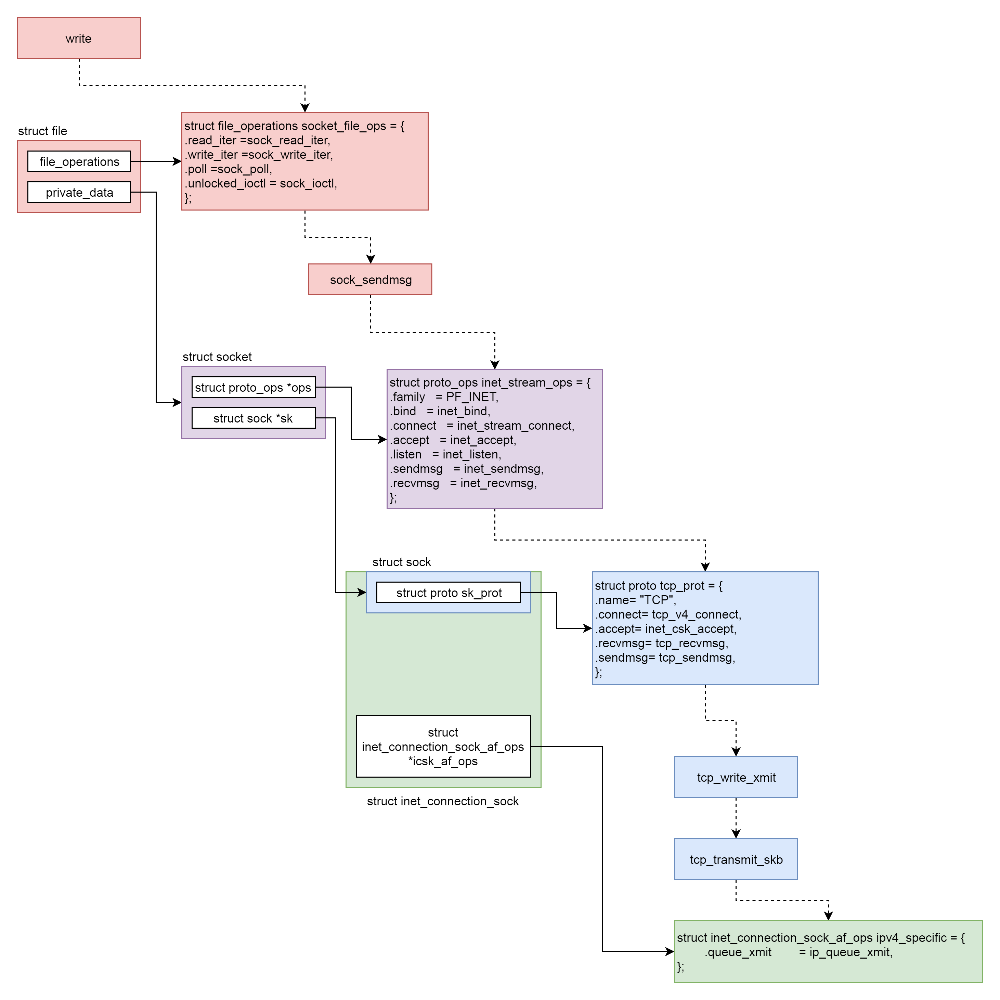

# 发送网络包
#### socket write
* struct file->struct socket->sock_sendmsg->sock_sendmsg_nosec
* msg->struct sk_buff->tcp写入队列->mss->数据拷贝到连续数据区域->发送网络包

#### 分散聚合
* IP层通过内存拷贝进行聚合，让散的数据零散的放在原处，在设备层进行聚合。如果使用这种模式，网络包的数据就不会放在连续的数据区域
* 

#### tcp_write_xmit
* TSO 分段->硬件网卡去做
* 拥塞窗口
* tcp_transmit_skb->ip_queue_xmit

#### 总结

* VFS 层：write 系统调用找到 struct file，根据里面的 file_operations 的定义，调用 sock_write_iter 函数。sock_write_iter 函数调用 sock_sendmsg 函数。
* Socket 层：从 struct file 里面的 private_data 得到 struct socket，根据里面 ops 的定义，调用 inet_sendmsg 函数。
* Sock 层：从 struct socket 里面的 sk 得到 struct sock，根据里面 sk_prot 的定义，调用 tcp_sendmsg 函数。
* TCP 层：tcp_sendmsg 函数会调用 tcp_write_xmit 函数，tcp_write_xmit 函数会调用 tcp_transmit_skb，在这里实现了 TCP 层面向连接的逻辑。
* IP 层：扩展 struct sock，得到 struct inet_connection_sock，根据里面 icsk_af_ops 的定义，调用 ip_queue_xmit 函数。

#### ip层发送
* 第一部分，选取路由，也即我要发送这个包应该从哪个网卡出去。
* 路由规则Trie树进行匹配
* 就是准备 IP 层的头，往里面填充内容。这就要对着 IP 层的头的格式进行理解。
* 第三部分，就是调用 ip_local_out 发送 IP 包。__ip_local_out是决定转发规则 
 * dst_output是真正的发送数据

#### mac层发送
* dev_queue_xmit
* 网络设备发送队列 struct netdev_queue *txq
* qdisc pfifo_fast 内核如果需要通过某个网络接口发送数据包，都需要按照为这个接口配置的 qdisc（排队规则）把数据包加入队列
*  __dev_xmit_skb -> __qdisc_run->__netif_schedule-> __netif_reschedule
* NET_TX_SOFTIRQ
* NET_RX_SOFTIRQ
* net_tx_action->qdisc_run->qdisc_restart->sch_direct_xmit->dev_hard_start_xmit->xmit_one->netdev_start_xmit->__netdev_start_xmit->ixgb_xmit_frame

#### 发送总流程
* VFS 层：write 系统调用找到 struct file，根据里面的 file_operations 的定义，调用 sock_write_iter 函数。sock_write_iter 函数调用 sock_sendmsg 函数。
* Socket 层：从 struct file 里面的 private_data 得到 struct socket，根据里面 ops 的定义，调用 inet_sendmsg 函数。
* Sock 层：从 struct socket 里面的 sk 得到 struct sock，根据里面 sk_prot 的定义，调用 tcp_sendmsg 函数。
* TCP 层：tcp_sendmsg 函数会调用 tcp_write_xmit 函数，tcp_write_xmit 函数会调用 tcp_transmit_skb，在这里实现了 TCP 层面向连接的逻辑。
* IP 层：扩展 struct sock，得到 struct inet_connection_sock，根据里面 icsk_af_ops 的定义，调用 ip_queue_xmit 函数。
* IP 层：ip_route_output_ports 函数里面会调用 fib_lookup 查找路由表。FIB 全称是 Forwarding Information Base，转发信息表，也就是路由表。
* 在 IP 层里面要做的另一个事情是填写 IP 层的头。
* 在 IP 层还要做的一件事情就是通过 iptables 规则。
* MAC 层：IP 层调用 ip_finish_output 进行 MAC 层。
* MAC 层需要 ARP 获得 MAC 地址，因而要调用 ___neigh_lookup_noref 查找属于同一个网段的邻居，他会调用 neigh_probe 发送 ARP。
* 有了 MAC 地址，就可以调用 dev_queue_xmit 发送二层网络包了，它会调用 __dev_xmit_skb 会将请求放入队列。
* 设备层：网络包的发送回触发一个软中断 NET_TX_SOFTIRQ 来处理队列中的数据。这个软中断的处理函数是 net_tx_action。
* 在软中断处理函数中，会将网络包从队列上拿下来，调用网络设备的传输函数 ixgb_xmit_frame，将网络包发的设备的队列上去。
* 