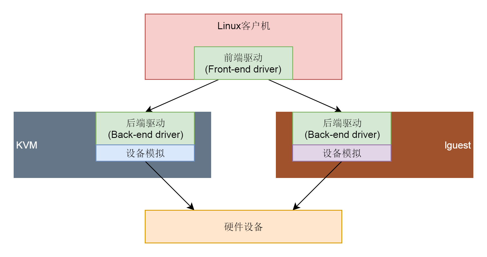
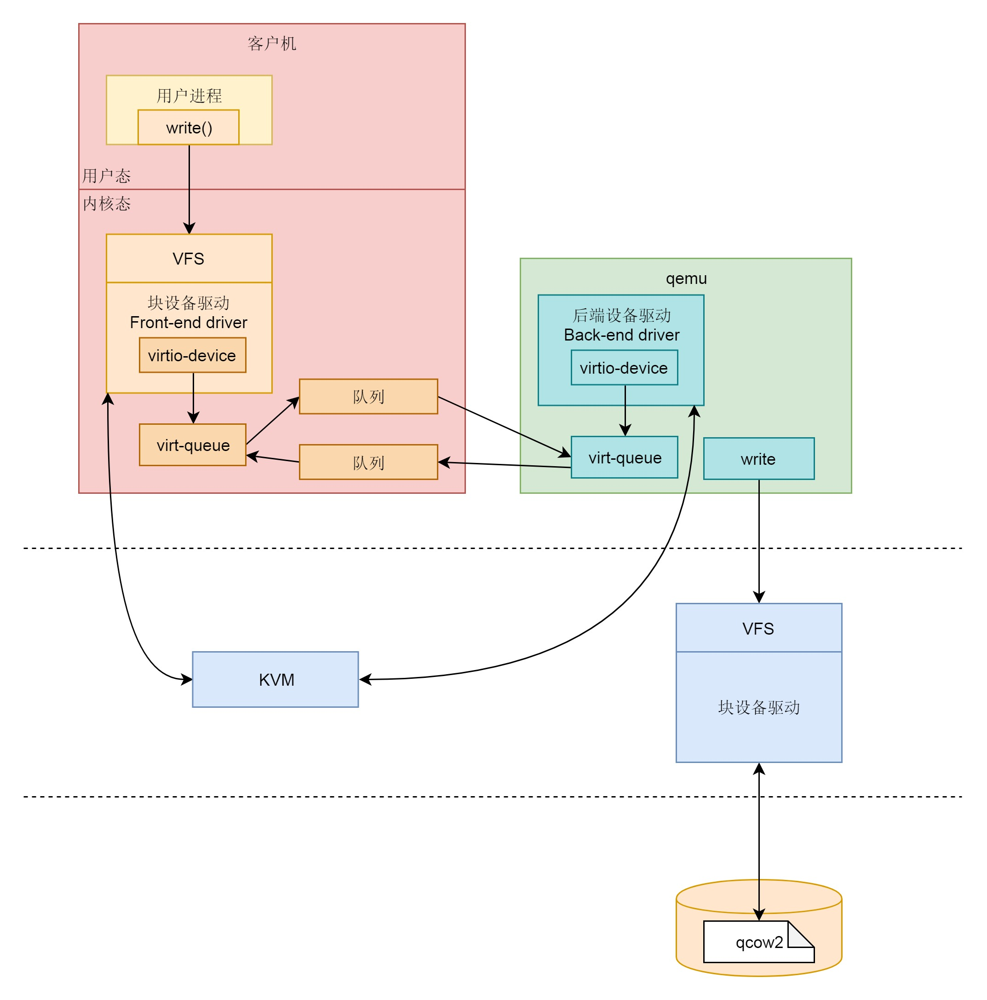
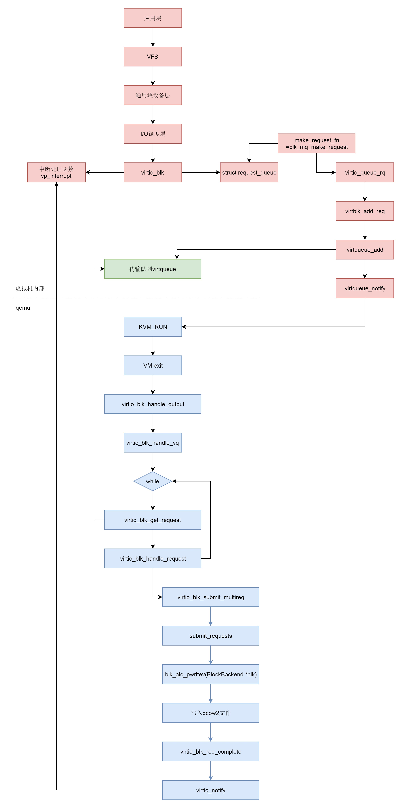

# 存储虚拟化

#### virtio
* virtio 负责对于虚拟机提供统一的接口
* 

#### 架构四层
* 虚拟机里面的 virtio 前端，针对不同类型的设备有不同的驱动程序，但是接口都是统一的
* 在宿主机的 qemu 里面，实现 virtio 后端的逻辑，主要就是操作硬件的设备
* virtio 的前端和后端之间，有一个通信层，里面包含virtio 层和virtio-ring 层

#### 总结
* 前端有前端的块设备驱动 Front-end driver，在客户机的内核里面，它符合普通设备驱动的格式，对外通过 VFS 暴露文件系统接口给客户机里面的应用。这一部分这一节我们没有讲，放在下一节解析。
* 后端有后端的设备驱动 Back-end driver，在宿主机的 qemu 进程中，当收到客户机的写入请求的时候，调用文件系统的 write 函数，写入宿主机的 VFS 文件系统，最终写到物理硬盘设备上的 qcow2 文件。
* 中间的队列用于前端和后端之间传输数据，在前端的设备驱动和后端的设备驱动，都有类似的数据结构 virt-queue 来管理这些队列
* 

#### 前端设备驱动virtio_blk
* virtqueue 是一个介于客户机前端和 qemu 后端的一个结构，用于在这两端之间传递数据
 
 ```
 struct vring_virtqueue {
	struct virtqueue vq;

	/* Actual memory layout for this queue */
	struct vring vring;
......
}
 ```
 * struct virtio_device 里面有一个 struct vring_virtqueue，在 struct vring_virtqueue 里面有一个 struct vring
 * 

#### 总结
* 
