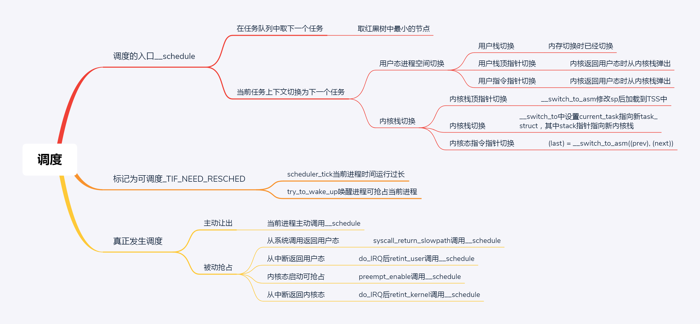

# 抢占式调度
####时间片
* 计算机隔一段时间触发时钟中断
* 计算进程分配的实际运行时间
* 进程总共执行的实际时间 - 上次被调度时总的的运行时间 = 本次实际运行时间
* 被调度条件
 * 本次实际运行时间 > 计算进程分配的实际运行时间
 * 当前进程的 vruntime 大于红黑树中最小的进程的 vruntime
 * 差值大于 ideal_runtime

#### 调度
* 打上TIF_NEED_RESCHED标签

#### 进程被唤醒
* 当被唤醒的进程优先级高于 CPU 上的当前进程，就会触发抢占
* 这个唤醒的任务添加到队列当中
* 激活任务
* 标记被抢占

#### 用户态抢占时机
* 用户态抢占时机 系统调用中返回的那个时刻，是一个被抢占的时机
* 中断中返回的那个时刻

#### 内核态抢占时机
* preempt_disable()-->preempt_enable()
* 内核态中断返回

#### 进程调度总结

 
 
