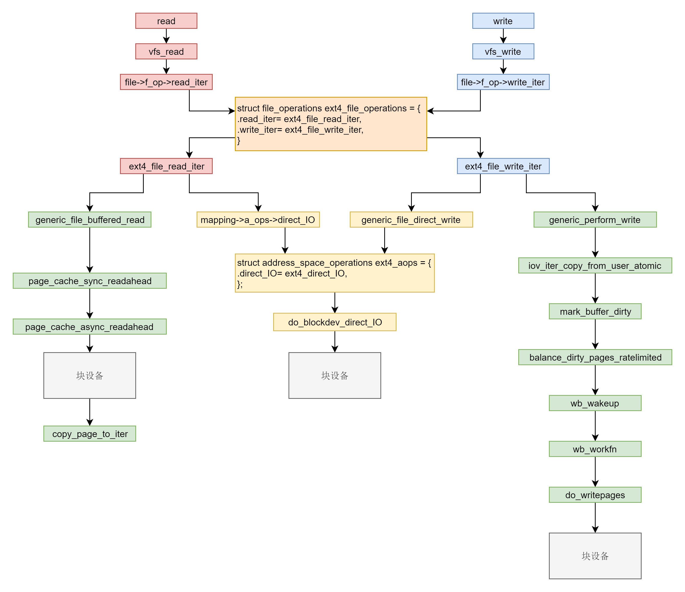

# 文件缓存
#### 系统调用和虚拟文件层
* vfs_read->__vfs_read
* vfs_write->__vfs_write

#### 文件I/O类型
* 缓存I/O
* 直接IO

#### address_space
* 文件和内存页面进行关联
* ext4_direct_IO->__blockdev_direct_IO->do_blockdev_direct_IO

#### 带缓存的写入操作
* 对于每一页，先调用 address_space 的 write_begin 做一些准备；
* 调用 iov_iter_copy_from_user_atomic，将写入的内容从用户态拷贝到内核态的页中；
* 调用 address_space 的 write_end 完成写操作；
* 调用 balance_dirty_pages_ratelimited，看脏页是否太多，需要写回硬盘。所谓脏页，就是写入到缓存，但是还没有写入到硬盘的页面。

#### ext4模式
* 日志模式
* order模式
* writeback

#### 缓存页面
* struct file->struct address_space->radix tree基数树->关联所有与文件相关的缓存

#### 回写场景
* 调用 balance_dirty_pages_ratelimited
* 用户主动调用 sync，将缓存刷到硬盘上去，最终会调用 wakeup_flusher_threads，同步脏页；
* 当内存十分紧张，以至于无法分配页面的时候，会调用 free_more_memory，最终会调用 wakeup_flusher_threads，释放脏页；
* 脏页已经更新了较长时间，时间上超过了 timer，需要及时回写，保持内存和磁盘上数据一致性

#### 总结
* 
