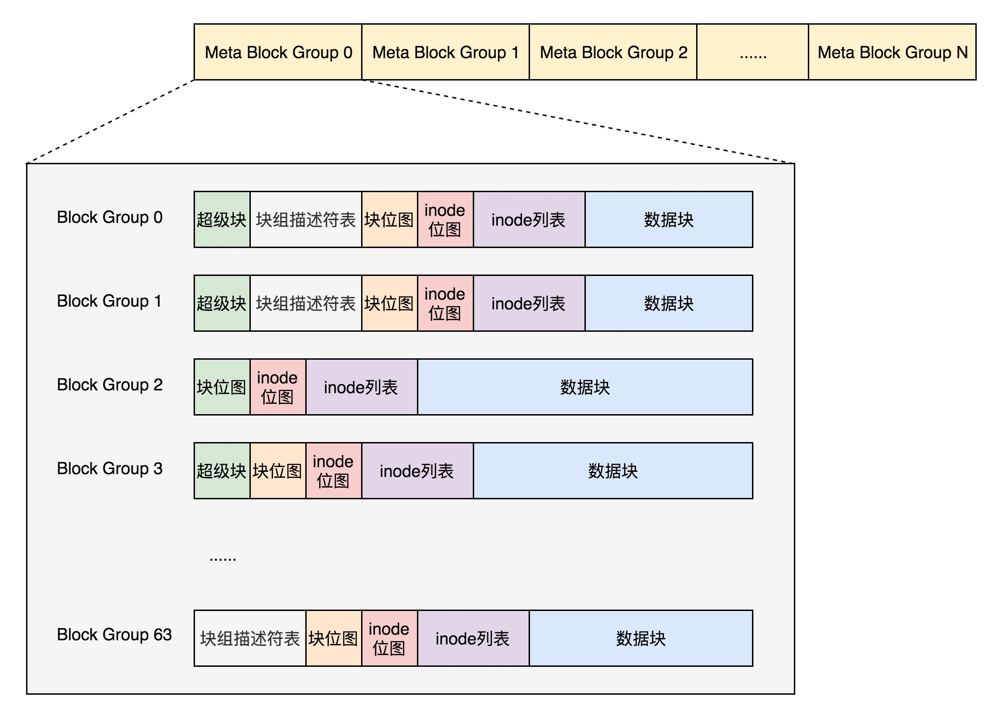

# 硬件文件系统
#### Inode与块
* 硬盘分成相同大小的单元，我们称为块（Block）。一块的大小是扇区大小的整数倍，默认是 4K
* 元数据需要Inode来存放
* i_atime 访问
* i_ctime 修改inode的时间 用户和权限
* i_mtime 更改文件内容的时间,修改数据

#### EXT4
* 前 12 项直接保存了块的位置，也就是说，我们可以通过 i_block[0-11]，直接得到保存文件内容的块
* i_block[12]一级间接块, i_block[13]二级间接块, i_block[14]三级间接块
* 

#### Extents
* 解决多级间接块访问速度过慢的问题
* 存放128M的连续块
* 采用树状结构
* 

#### inode 位图和块位图
* 用一个块中的位表示一个块
* 用一个块中的位表示一个inode节点
* 创建一个文件流程
* do_sys_open->do_file_open->path_openat->do_last->lookup_open
* ext4_create->ext4_new_inode_start_handle->__ext4_new_inode
* 创建新的inode

#### 文件系统的格式

##### 一个块组组成
* ext4_group_desc
* inode位图 bg_inode_bitmap_lo
* 块位图 bg_block_bitmap_lo
* inode列表 bg_inode_table_lo

#### 超级块
* ext4_super_block
* 

#### Meta Block Groups
* 将一个块组切分多个组
* 

#### 目录的存储格式
* 查找一个目录下面的文件名，可以通过名称取哈希
*  

#### 软硬连接的存储格式
* 硬链接与原始文件共用一个 inode 的，但是 inode 是不跨文件系统的，每个文件系统都有自己的 inode 列表，因而硬链接是没有办法跨文件系统的
* 软链接不同，软链接相当于重新创建了一个文件。这个文件也有独立的 inode，只不过打开这个文件看里面内容的时候，内容指向另外的一个文件
* 

