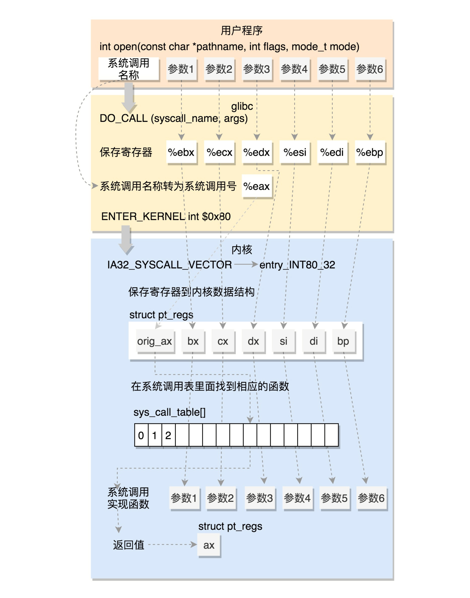

# 系统调用的流程

#### 32位系统的调用流程

* 将调用参数放入寄存器中, 由系统调用名得到系统调用号, 放入 eax
* 执行 ENTER_KERNEL(一个宏), 对应 int $0x80 触发软中断, 进入内核
* 调用软中断处理函数 entry_INT80_32(内核启动时, 由 trap_init() 配置)
* entry_INT80_32 将用户态寄存器存入 pt_regs 中(保存现场以及系统调用参数), 调用 do_syscall_32_iraq_on 
* do_syscall_32_iraq_on 从 pt_regs 中取系统调用号(eax), 从系统调用表得到对应实现函数, 取 pt_regs 中存储的参数, 调用系统调用
* entry_INT80_32 调用 INTERRUPT_RUTURN(一个宏)对应 iret 指令, 系统调用结果存在 pt_regs 的 eax 位置, 根据 pt_regs 恢复用户态进程

#### 64位系统的调用流程

* 通过系统调用名得到系统调用号, 存入 rax; 不同中断, 执行 syscall 指令
* MSR(特殊模块寄存器), 辅助完成某些功能(包括系统调用)
* trap_init() 会调用 cpu_init->syscall_init 设置该寄存器
* syscall 从 MSR 寄存器中, 拿出函数地址进行调用, 即调用 entry_SYSCALL_64
* entry_SYSCALL_64 先保存用户态寄存器到 pt_regs 中
* 调用 entry_SYSCALL64_slow_pat->do_syscall_64
* do_syscall_64 从 rax 取系统调用号, 从系统调用表得到对应实现函数, 取 pt_regs 中存储的参数, 调用系统调用
* 返回执行 USERGS_SYSRET64(一个宏), 对应执行 swapgs 和 sysretq 指令; 系统调用结果存在 pt_regs 的 ax 位置, 根据 pt_regs 恢复用户态进程

#### 64位系统调用的流程

