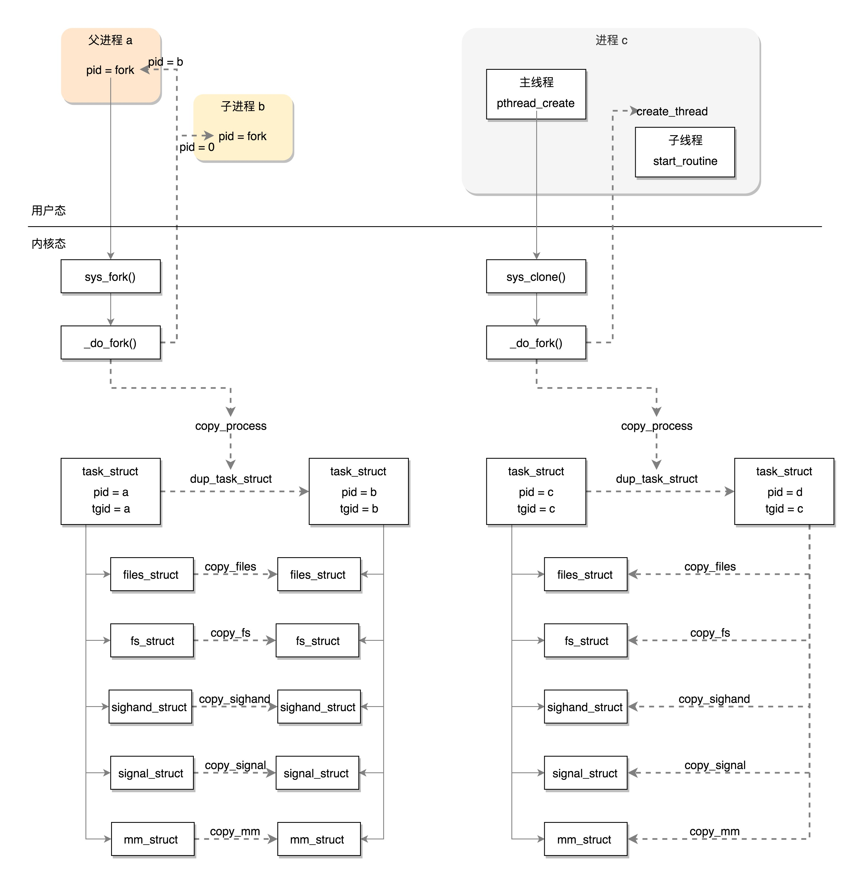

# 线程的创建
#### 原理
* 由内核态和用户态合作完成的
* 用户态维护线程的结构 pthread

#### 线程栈的创建
* 设置栈的大小，需要你把设置的值拿出来；
* 为了防止栈的访问越界，在栈的末尾设置guardsize，一旦访问到这里就错误了；
* get_cached_stack 从缓存中获取已经存在的线程
* __mmap创建新的线程内存区域
* 计算出 guard 内存的位置
* 设置pthread 这个结构里面的成员变量 stackblock、stackblock_size、guardsize、specific。这里的 specific 是用于存放 Thread Specific Data 的，也即属于线程的全局变量；
* 将这个线程栈放到 stack_used 链表中，其实管理线程栈总共有两个链表，一个是 stack_used，也就是这个栈正被使用；另一个是 stack_cache，就是上面说的，一旦线程结束，先缓存起来，不释放，等有其他的线程创建的时候，给其他的线程用。

#### 内核态创建任务
* start_routine
* __nptl_nthreads 线程数加1
* create_thread 创建线程
* --clone-->do_fork

##### 标志位设定
* CLONE_FS copy_fs 
* CLONE_SIGHAND copy_sighand
* CLONE_VM copy_mm

##### 亲缘关系
*  CLONE_THREAD 

##### 信号处理
* kill 进程
* pthread_kill 线程
* 初始化 struct sigpending pending
* 返回用户态

#### 用户态执行线程
* start_thread 统一入口
* 调用完毕线程数目减1

#### 总结

* 查看进程和线程栈的使用情况
* pstack
* pstree

