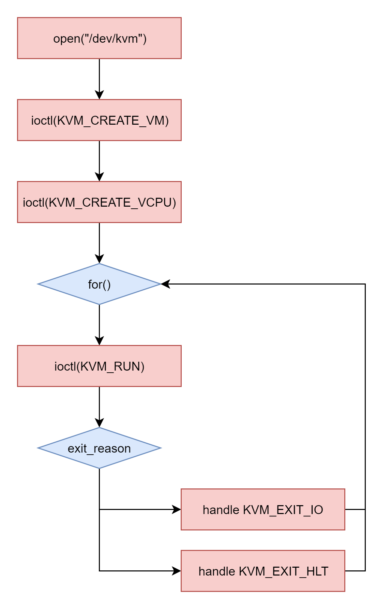
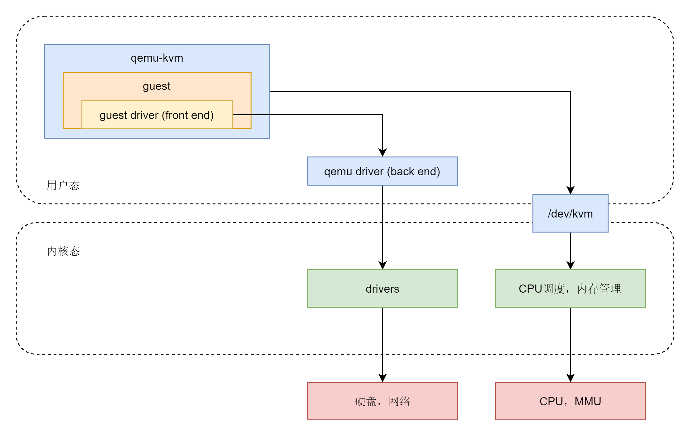

# 虚拟化
#### KVM内核模块
* 通过 /dev/kvm 暴露接口，用户态程序可以通过 ioctl 来访问这个接口
* 
* Qemu 将 KVM 整合进来，将有关 CPU 指令的部分交由内核模块来做，就是 qemu-kvm 
* 网络需要virtio_net
* 存储需要virtio_blk

#### kvm工作原理
* 

#### 总结
* 虚拟化的本质是用 qemu 的软件模拟硬件，但是模拟方式比较慢，需要加速；
* 虚拟化主要模拟 CPU、内存、网络、存储，分别有不同的加速办法；
* CPU 和内存主要使用硬件辅助虚拟化进行加速，需要配备特殊的硬件才能工作；
* 网络和存储主要使用特殊的半虚拟化驱动加速，需要加载特殊的驱动程序。