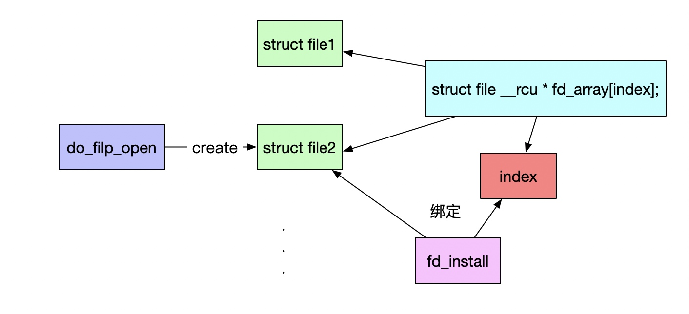

# 虚拟文件系统
#### 文件系统结构
* 

#### 挂载文件系统
* do_mount->do_new_mount->vfs_kern_mount
* mnt_parent 是装载点所在的父文件系统，mnt_mountpoint 是装载点在父文件系统中的 dentry；struct dentry 表示目录，并和目录的 inode 关联；mnt_root 是当前文件系统根目录的 dentry，mnt_sb 是指向超级块的指针

#### 打开文件
* task_struct 中，有一个指针 files，类型是 files_struct
* 文件描述符列表的每一项都是一个指向 struct file 的指针，也就是说，每打开一个文件，都会有一个 struct file 对应
* do_sys_open 中调用 do_filp_open，就是创建这个 struct file 结构，然后 fd_install(fd, f) 是将文件描述符和这个结构关联起来


####  path_openat
* get_empty_filp 生成一个 struct file 结构；
* path_init 初始化 nameidata，准备开始节点路径查找；
* link_path_walk 对于路径名逐层进行节点路径查找，这里面有一个大的循环，用“/”分隔逐层处理；
* do_last 获取文件对应的 inode 对象，并且初始化 file 对象。

#### 总结


#### strace 追踪
```
execve("/bin/mount", ["mount", "/dev/sdc", "/test_flash"], [/* 26 vars */]) = 0
open("/lib64/libmount.so.1", O_RDONLY|O_CLOEXEC) = 3
lstat("/run/mount/utab", 0x7ffebb0a8130) = -1 ENOENT (No such file or directory)
mkdir("/run/mount", 0755)               = -1 EEXIST (File exists)
stat("/run/mount/utab", 0x7ffebb0a8020) = -1 ENOENT (No such file or directory)
stat("/run/mount", {st_mode=S_IFDIR|0755, st_size=40, ...}) = 0
access("/run/mount", R_OK|W_OK)         = 0
stat("/sbin/mount.ext4", 0x7ffebb0a6fc0) = -1 ENOENT (No such file or directory)
stat("/sbin/fs.d/mount.ext4", 0x7ffebb0a6fc0) = -1 ENOENT (No such file or directory)
stat("/sbin/fs/mount.ext4", 0x7ffebb0a6fc0) = -1 ENOENT (No such file or directory)
mount("/dev/sdc", "/test_flash", "ext4", MS_MGC_VAL, NULL) = 0
```
* 