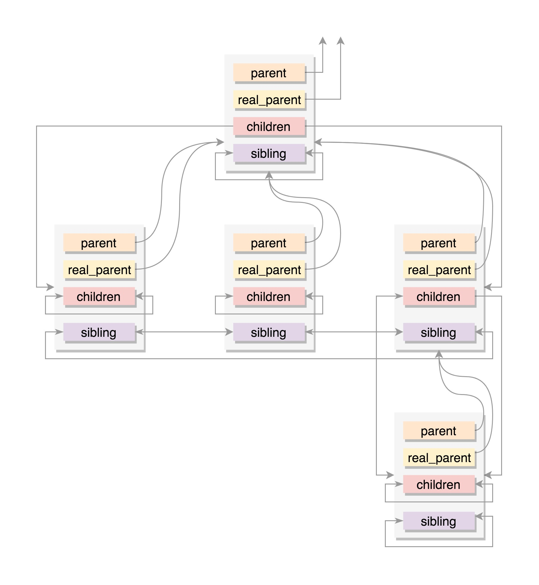
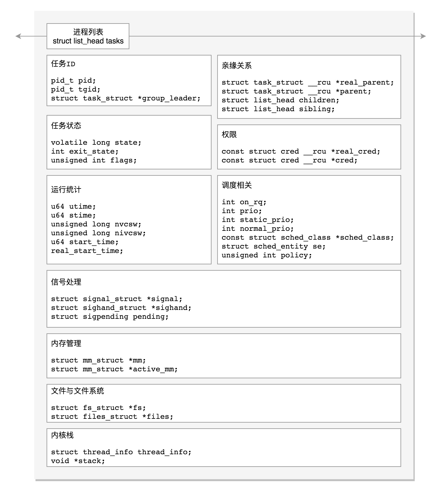

# 进程数据结构
#### task_struct
* 任务ID
* 任务展示

#### 三种睡眠状态
* TASK_INTERRUPTIBLE，可中断的睡眠状态
* TASK_UNINTERRUPTIBLE，不可中断的睡眠状态
* TASK_KILLABLE，可以终止的新睡眠状态 可以响应致命信号

#### 进程调度
* 任务状态
* 信号处理
* 任务ID
* 调度相关

#### 运行统计信息
#### 进程亲缘关系
* parent 指向其父进程。当它终止时，必须向它的父进程发送信号。
* children 表示链表的头部。链表中的所有元素都是它的子进程。
* sibling 用于把当前进程插入到兄弟链表中。

#### 用户和用户组的信息
* uid gid
* euid egid
* fsuid fsgid

#### capabilites
* cap_permitted 表示进程能够使用的权限
* cap_bset，也就是 capability bounding set，是系统中所有进程允许保留的权限。如果这个集合中不存在某个权限，那么系统中的所有进程都没有这个权限。即使以超级用户权限执行的进程，也是一样的
* cap_ambient 是比较新加入内核,执行 exec 的时候，cap_ambient 会被添加到 cap_permitted 中，同时设置到 cap_effective 中

#### 进程
* 任务ID
* 亲缘关系
* 任务状态
* 权限
* 运行统计
* 调度相关
* 信号处理
* 内存管理
* 文件和文件系统
* 内核栈 

#### 用户栈和内核栈的具体实现
* 用户栈详解：http://blog.csdn.net/tiankong_/article/details/75676131
* 内核栈详解：http://blog.csdn.net/tiankong_/article/details/75647488

#### 用户态函数栈
* 栈是一个从高地址到低地址，往下增长的结构，也就是上面是栈底，下面是栈顶，入栈和出栈的操作都是从下面的栈顶开始的。

#### 用户态和内核态执行
* struct thread_info thread_info;
* void  *stack;

#### 内核栈
 

#### task_struct找内核
* task_struct找内核栈是通过stack指针，直接找到内核线程栈，stack指针记录的是内核栈的首地址。
* task_struck找内核寄存器是通过 内核栈的首地址（1中的stack指针） + (THREAD_SIZE - TOP_OF_KERNEL_STACK_PADDING)定位到pt_regs的最高位地址，再减一得到pt_regs的最低位地址（首地址）

#### 内核找task_struct
* 通过内核栈找到 task_struct
  32位 直接由 thread_info 中的指针得到
  64位 每个 CPU 当前运行进程的 task_struct 的指针存放到 Per CPU 变量 current_task 中
 
 #### 