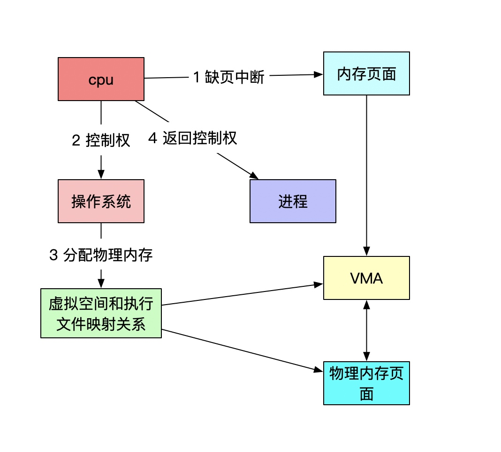

# 可执行文件的装载和进程

#### 进程的建立
* 创建一个独立的虚拟地址空间
* 读取可执行文件头，并且建立虚拟空间与可执行文件的映射关系
* 将cpu的指令寄存器的设置成可执行的文件的入口地址, ELF文件头的入口地址

#### 页错误
* 

#### ELF文件链接视图和执行视图
* Section是从链接视图划分ELF
* Segment是从执行视图划分ELF
* 相同属性的Section会被归类到一个segment，映射到同一个VMA

#### 总结
* 操作系统通过给进程空间划分为一个一个VMA来管理进程虚拟空间，依据原则是相同权限属性和相同映像文件映射成一个VMA

#### 装载过程
* load_elf_binary
* load_script

#### 装载过程
* 检查ELF可执行文件格式的有效性，比如魔数、程序头表中段
(Segment)的数量。
* 寻找动态链技的.interp段，设置动态链接器路径(与动态链接有关，具体
只读数据。
* 根据ELF文件的程序表头的描述，对ELF文件进行映射，代码，数据，只读数据
* 初始化ELF文件进程环境
* 将系统调用的返回地址修改成对于静态链接的ELF可执行文件的入口点，对于动态链接的
ELF可执行文件，这个程序入口就是动态连接器